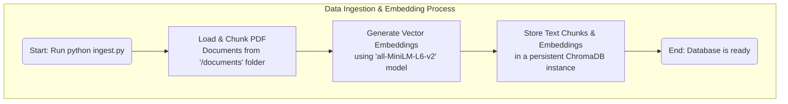
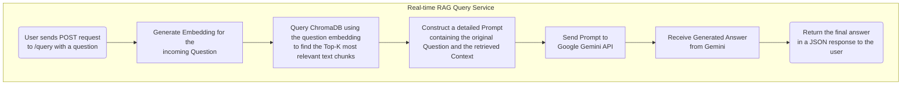

# AI-Powered Document Q&A System with Google Gemini

This project implements a complete Retrieval-Augmented Generation (RAG) pipeline to create a sophisticated Question & Answering system. It leverages a local vector database for efficient, semantic search across private documents and utilizes the **Google Gemini API** for intelligent, context-aware answer generation. The entire system is deployed as a scalable REST API using FastAPI.

This project serves as a demonstration of building modern, full-stack AI applications, combining data processing, vector search, and large language models (LLMs) into a cohesive service.

## Architecture Diagram

The system follows a decoupled, two-stage architecture: a one-time data ingestion process and a real-time query-serving API. This separation of concerns ensures that the API remains fast and responsive, while the data processing can be run independently to update the knowledge base.

### 1. Ingestion Pipeline (`ingest.py`)

This script processes source documents and populates the vector database. It is run once to initialize the database or whenever the knowledge base needs to be updated with new documents.



### 2. API Query Pipeline (`main.py`)

This is the live API service that answers user questions by leveraging the pre-populated database and the Google Gemini API for generation.



## Core Features

*   **Dynamic Data Ingestion:** Automatically loads, processes, and chunks text from PDF documents.
*   **Local Vector Database:** Uses `ChromaDB` to store text chunks and their corresponding vector embeddings for fast, local semantic search.
*   **State-of-the-Art Embeddings:** Employs a `SentenceTransformer` model (`all-MiniLM-L6-v2`) to generate meaningful numerical representations of text.
*   **Context-Aware Generation:** Leverages the **Google Gemini API** to generate answers that are factually grounded in the retrieved document context, minimizing hallucinations.
*   **Scalable REST API:** Exposes the Q&A functionality through a robust and documented API built with `FastAPI` and served by `Uvicorn`.
*   **Decoupled Workflow:** Separates the data ingestion process (`ingest.py`) from the API serving logic (`main.py`) for efficiency and scalability.

## Tech Stack

| Category          | Technology                                         |
| ----------------- | -------------------------------------------------- |
| **Core Logic**    | Python 3.11                                        |
| **LLM & API**     | Google Gemini API (`google-generativeai`)          |
| **Embeddings**    | Hugging Face Sentence Transformers (`all-MiniLM-L6-v2`) |
| **Vector Database** | ChromaDB (Local, Persistent)                       |
| **API Framework**   | FastAPI, Uvicorn                                   |
| **Data Handling**   | PyPDF, Python-dotenv                               |

## Setup and Usage

Follow these steps to set up and run the project locally.

### Prerequisites

*   Git
*   Python 3.9+
*   A Google Gemini API Key (obtainable from [Google AI Studio](https://aistudio.google.com/))

### 1. Clone the Repository

```bash
git clone https://github.com/abdkhaleel/RAG-QnA-System.git
cd RAG-QnA-System
```

### 2. Set Up the Python Virtual Environment

This creates an isolated environment for the project's dependencies.

```bash
# For Windows
python -m venv venv
.\venv\Scripts\activate

# For macOS/Linux
python3 -m venv venv
source venv/bin/activate
```

### 3. Install Dependencies

```bash
pip install -r requirements.txt
```

### 4. Configure Environment Variables

Create a file named `.env` in the root of the project directory and add your Google API key:

```
GOOGLE_API_KEY=YourApiKeyGoesHere
```

### 5. Add Your Documents

Place one or more PDF files that you want to query inside the `documents` folder.

### 6. Run the Ingestion Script

This script will process your documents and build the local vector database. You only need to run this once, or again when you add new documents.

```bash
python ingest.py
```

### 7. Run the API Server

Once the ingestion is complete, start the FastAPI server.

```bash
python main.py
```
The server will be running at `http://127.0.0.1:8000`.

### 8. Interact with the API

Navigate to `http://127.0.0.1:8000/docs` in your web browser to access the interactive FastAPI documentation. You can use this interface to send questions to the `/query` endpoint and receive answers.

## Potential Enhancements

*   **Containerize with Docker:** Create a `Dockerfile` to package the application for consistent deployment and scalability.
*   **Add a User Interface:** Build a simple front-end using Streamlit or React to provide a user-friendly chat interface.
*   **Support More Document Types:** Extend the ingestion script to handle `.txt`, `.docx`, and website URLs.
*   **Implement Conversational Memory:** Allow for follow-up questions by storing and passing conversation history in the prompt.